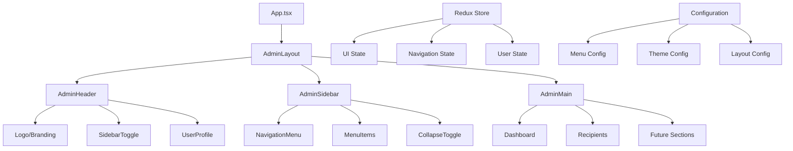

# Design Document - Admin Layout & Navigation System

## Overview

This document outlines the comprehensive design for a professional, scalable admin layout system built with modern web technologies. The system leverages CSS Grid for optimal performance, React components for modularity, and Redux for state management, creating a foundation that can be reused across multiple projects while maintaining the highest standards of user experience and developer productivity.

## Architecture

### High-Level Architecture



### CSS Grid Layout Structure

```css
.admin-layout {
  display: grid;
  grid-template-areas: 
    "header header"
    "sidebar main";
  grid-template-rows: 64px 1fr;
  grid-template-columns: var(--sidebar-width) 1fr;
  height: 100vh;
  overflow: hidden;
}

/* Responsive Breakpoints */
@media (max-width: 1023px) {
  grid-template-columns: 60px 1fr; /* Collapsed sidebar */
}

@media (max-width: 767px) {
  grid-template-areas: 
    "header header"
    "main main";
  grid-template-columns: 1fr;
}
```

## Components and Interfaces

### 1. AdminLayout Component

**Purpose:** Root layout container that orchestrates the entire admin interface

**Props Interface:**
```typescript
interface AdminLayoutProps {
  children: React.ReactNode;
  className?: string;
  sidebarCollapsed?: boolean;
  onSidebarToggle?: () => void;
}
```

**Key Features:**
- CSS Grid-based layout management
- Responsive behavior handling
- State management integration
- Theme consistency enforcement

### 2. AdminHeader Component

**Purpose:** Top navigation bar with branding, controls, and user information

**Props Interface:**
```typescript
interface AdminHeaderProps {
  user: UserProfile;
  onSidebarToggle: () => void;
  onLogout: () => void;
  showSidebarToggle?: boolean;
  className?: string;
}
```

**Sub-components:**
- `HeaderLogo`: Branding and navigation home
- `SidebarToggle`: Mobile/tablet sidebar control
- `UserProfileDropdown`: User info and actions

### 3. AdminSidebar Component

**Purpose:** Configurable navigation sidebar with dynamic menu system

**Props Interface:**
```typescript
interface AdminSidebarProps {
  menuItems: MenuItem[];
  collapsed: boolean;
  onToggle: () => void;
  activeRoute: string;
  className?: string;
}

interface MenuItem {
  id: string;
  label: string;
  icon: React.ComponentType<IconProps>;
  route: string;
  badge?: string | number;
  children?: MenuItem[];
  permissions?: string[];
}
```

**Sub-components:**
- `NavigationMenu`: Main menu container
- `MenuItem`: Individual navigation items
- `MenuGroup`: Grouped menu sections
- `CollapseToggle`: Sidebar state control

### 4. AdminMain Component

**Purpose:** Main content area with consistent spacing and scroll management

**Props Interface:**
```typescript
interface AdminMainProps {
  children: React.ReactNode;
  title?: string;
  breadcrumbs?: Breadcrumb[];
  actions?: React.ReactNode;
  className?: string;
}

interface Breadcrumb {
  label: string;
  route?: string;
}
```

### 5. Configuration System

**Menu Configuration:**
```typescript
interface MenuConfiguration {
  items: MenuItem[];
  defaultCollapsed: boolean;
  persistState: boolean;
  mobileBreakpoint: number;
  tabletBreakpoint: number;
}

const defaultMenuConfig: MenuConfiguration = {
  items: [
    {
      id: 'dashboard',
      label: 'Dashboard',
      icon: DashboardIcon,
      route: '/dashboard'
    },
    {
      id: 'recipients',
      label: 'Gestionar Destinatarios',
      icon: UsersIcon,
      route: '/admin/recipients'
    }
  ],
  defaultCollapsed: false,
  persistState: true,
  mobileBreakpoint: 768,
  tabletBreakpoint: 1024
};
```

## Data Models

### UI State Model

```typescript
interface AdminUIState {
  sidebar: {
    collapsed: boolean;
    mobileOpen: boolean;
    persistCollapsed: boolean;
  };
  header: {
    height: number;
    showBreadcrumbs: boolean;
  };
  main: {
    padding: string;
    maxWidth?: string;
  };
  responsive: {
    breakpoint: 'mobile' | 'tablet' | 'desktop';
    isMobile: boolean;
    isTablet: boolean;
  };
}
```

### Navigation State Model

```typescript
interface NavigationState {
  activeRoute: string;
  menuItems: MenuItem[];
  breadcrumbs: Breadcrumb[];
  routeHistory: string[];
}
```

### Theme Integration Model

```typescript
interface AdminTheme {
  layout: {
    headerHeight: string;
    sidebarWidth: {
      expanded: string;
      collapsed: string;
    };
    mainPadding: string;
    borderRadius: string;
  };
  colors: {
    background: string;
    surface: string;
    border: string;
    text: {
      primary: string;
      secondary: string;
      muted: string;
    };
    accent: {
      primary: string;
      secondary: string;
    };
  };
  effects: {
    glassmorphism: string;
    backdropBlur: string;
    shadow: string;
  };
}
```

## Error Handling

### Layout Error Boundaries

```typescript
interface LayoutErrorBoundaryState {
  hasError: boolean;
  errorInfo?: {
    componentStack: string;
    errorBoundary: string;
  };
}
```

**Error Recovery Strategies:**
1. **Component-level errors:** Graceful degradation with fallback UI
2. **Navigation errors:** Redirect to dashboard with error notification
3. **State errors:** Reset to default state with user notification
4. **Network errors:** Retry mechanisms with user feedback

### Error Handling Patterns

1. **Sidebar Navigation Errors:**
   - Fallback to basic menu structure
   - Log errors for debugging
   - Maintain core navigation functionality

2. **Content Loading Errors:**
   - Show error boundaries with retry options
   - Maintain layout structure
   - Provide clear error messages

3. **State Management Errors:**
   - Reset to safe default states
   - Preserve user session
   - Log errors for analysis

## Testing Strategy

### Component Testing Approach

1. **Unit Tests:**
   - Individual component rendering
   - Props handling and validation
   - Event handling and callbacks
   - State management integration

2. **Integration Tests:**
   - Layout composition and interaction
   - Navigation flow testing
   - Responsive behavior validation
   - Theme integration testing

3. **E2E Tests:**
   - Complete user workflows
   - Cross-browser compatibility
   - Performance benchmarking
   - Accessibility compliance

### Testing Tools and Frameworks

```typescript
// Test Configuration
interface TestingConfig {
  unit: {
    framework: 'Jest + React Testing Library';
    coverage: {
      threshold: 90;
      includeComponents: true;
      includeHooks: true;
    };
  };
  integration: {
    framework: 'Jest + React Testing Library';
    scenarios: [
      'sidebar-navigation',
      'responsive-behavior',
      'theme-switching',
      'state-persistence'
    ];
  };
  e2e: {
    framework: 'Playwright';
    browsers: ['chromium', 'firefox', 'webkit'];
    scenarios: [
      'admin-workflow',
      'mobile-navigation',
      'accessibility-compliance'
    ];
  };
}
```

### Performance Testing

1. **Metrics to Monitor:**
   - First Contentful Paint (FCP)
   - Largest Contentful Paint (LCP)
   - Cumulative Layout Shift (CLS)
   - Time to Interactive (TTI)

2. **Performance Targets:**
   - Initial load: < 2 seconds
   - Navigation transitions: < 300ms
   - Sidebar toggle: < 150ms
   - Content switching: < 500ms

## Implementation Architecture

### File Structure

```
src/
├── features/
│   └── admin/
│       ├── components/
│       │   ├── layout/
│       │   │   ├── AdminLayout.tsx
│       │   │   ├── AdminHeader.tsx
│       │   │   ├── AdminSidebar.tsx
│       │   │   └── AdminMain.tsx
│       │   ├── navigation/
│       │   │   ├── NavigationMenu.tsx
│       │   │   ├── MenuItem.tsx
│       │   │   └── MenuGroup.tsx
│       │   └── ui/
│       │       ├── UserProfileDropdown.tsx
│       │       └── SidebarToggle.tsx
│       ├── hooks/
│       │   ├── useAdminLayout.ts
│       │   ├── useNavigation.ts
│       │   └── useResponsive.ts
│       ├── store/
│       │   ├── adminSlice.ts
│       │   └── navigationSlice.ts
│       ├── config/
│       │   ├── menuConfig.ts
│       │   └── layoutConfig.ts
│       └── types/
│           ├── layout.ts
│           └── navigation.ts
├── pages/
│   ├── admin/
│   │   ├── DashboardPage.tsx
│   │   └── RecipientsPage.tsx
└── styles/
    └── admin/
        ├── layout.css
        ├── navigation.css
        └── responsive.css
```

### State Management Architecture

```typescript
// Redux Store Structure
interface RootState {
  admin: {
    ui: AdminUIState;
    navigation: NavigationState;
  };
  auth: AuthState;
  user: UserState;
}

// Action Types
enum AdminActionTypes {
  TOGGLE_SIDEBAR = 'admin/toggleSidebar',
  SET_ACTIVE_ROUTE = 'admin/setActiveRoute',
  UPDATE_BREADCRUMBS = 'admin/updateBreadcrumbs',
  SET_RESPONSIVE_BREAKPOINT = 'admin/setResponsiveBreakpoint',
}
```

### CSS Architecture

```scss
// CSS Custom Properties for Dynamic Theming
:root {
  // Layout Variables
  --admin-header-height: 64px;
  --admin-sidebar-width-expanded: 280px;
  --admin-sidebar-width-collapsed: 60px;
  --admin-main-padding: 24px;
  
  // Responsive Breakpoints
  --breakpoint-mobile: 768px;
  --breakpoint-tablet: 1024px;
  --breakpoint-desktop: 1200px;
  
  // Animation Variables
  --transition-sidebar: width 0.3s cubic-bezier(0.4, 0, 0.2, 1);
  --transition-content: margin-left 0.3s cubic-bezier(0.4, 0, 0.2, 1);
}

// Grid Layout System
.admin-layout {
  display: grid;
  grid-template-areas: 
    "header header"
    "sidebar main";
  grid-template-rows: var(--admin-header-height) 1fr;
  grid-template-columns: var(--sidebar-width) 1fr;
  
  &--sidebar-collapsed {
    --sidebar-width: var(--admin-sidebar-width-collapsed);
  }
  
  &--sidebar-expanded {
    --sidebar-width: var(--admin-sidebar-width-expanded);
  }
}
```

## Security Considerations

### Access Control

1. **Route Protection:**
   - Role-based access control for menu items
   - Dynamic menu rendering based on permissions
   - Secure route guards for admin sections

2. **Component Security:**
   - Input sanitization for dynamic content
   - XSS prevention in user-generated content
   - Secure state management practices

### Data Protection

1. **State Security:**
   - Sensitive data encryption in localStorage
   - Secure token handling
   - Automatic session cleanup

2. **Navigation Security:**
   - Prevent unauthorized route access
   - Secure breadcrumb generation
   - Protected admin area isolation

## Accessibility Implementation

### WCAG 2.1 AA Compliance

1. **Keyboard Navigation:**
   - Full keyboard accessibility for all interactive elements
   - Logical tab order throughout the interface
   - Keyboard shortcuts for common actions

2. **Screen Reader Support:**
   - Semantic HTML structure
   - Comprehensive ARIA labels and descriptions
   - Live regions for dynamic content updates

3. **Visual Accessibility:**
   - High contrast color schemes
   - Scalable text and UI elements
   - Reduced motion support for animations

### Accessibility Testing

```typescript
interface AccessibilityConfig {
  testing: {
    tools: ['axe-core', 'jest-axe', 'lighthouse'];
    standards: ['WCAG 2.1 AA'];
    automation: {
      ci: true;
      coverage: 100;
    };
  };
  features: {
    keyboardNavigation: true;
    screenReaderSupport: true;
    highContrast: true;
    reducedMotion: true;
  };
}
```

This design provides a comprehensive foundation for building a world-class admin interface that is scalable, maintainable, and reusable across projects while maintaining the highest standards of user experience and technical excellence.