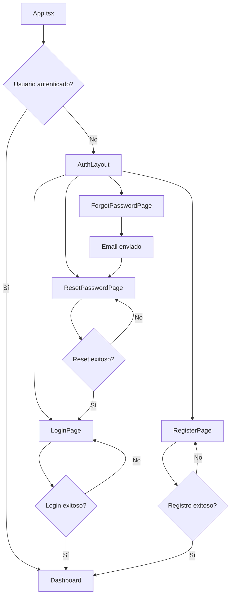

# Design Document

## Overview

El sistema de autenticación será implementado siguiendo una arquitectura limpia y modular, aprovechando las librerías disponibles (React Router DOM, Redux Toolkit, Firebase, Ant Design) y manteniendo el diseño glassmorphism establecido. La solución será completamente responsive y seguirá las mejores prácticas de seguridad.

## Architecture

### Estructura de Directorios

```
src/
├── components/
│   ├── auth/
│   │   ├── AuthLayout.tsx          # Layout común para páginas de auth
│   │   ├── LoginForm.tsx           # Formulario de login
│   │   ├── RegisterForm.tsx        # Formulario de registro
│   │   ├── ForgotPasswordForm.tsx  # Formulario recuperación
│   │   └── PasswordStrengthMeter.tsx # Indicador fuerza contraseña
│   └── ui/
│       ├── Button.tsx              # Botón reutilizable
│       ├── Input.tsx               # Input reutilizable
│       └── Toast.tsx               # Sistema de notificaciones
├── pages/
│   └── auth/
│       ├── LoginPage.tsx           # Página de login
│       ├── RegisterPage.tsx        # Página de registro
│       ├── ForgotPasswordPage.tsx  # Página recuperación
│       └── ResetPasswordPage.tsx   # Página nueva contraseña
├── hooks/
│   ├── useAuth.tsx                 # Hook personalizado auth
│   ├── useForm.tsx                 # Hook para manejo formularios
│   └── useToast.tsx                # Hook para notificaciones
├── services/
│   ├── authService.ts              # Servicios de autenticación
│   └── firebaseConfig.ts           # Configuración Firebase
├── store/
│   ├── authSlice.ts                # Redux slice para auth
│   └── store.ts                    # Configuración store
├── types/
│   ├── auth.ts                     # Tipos de autenticación
│   └── api.ts                      # Tipos de API
├── utils/
│   ├── validation.ts               # Funciones de validación
│   ├── constants.ts                # Constantes de la app
│   └── helpers.ts                  # Funciones auxiliares
└── styles/
    └── theme.ts                    # Tokens de diseño
```

### Flujo de Navegación



## Components and Interfaces

### AuthLayout Component

```typescript
interface AuthLayoutProps {
  children: React.ReactNode;
  title: string;
  subtitle?: string;
}

// Proporciona el layout común con:
// - Gradiente de fondo consistente
// - Efectos glassmorphism
// - Responsive design
// - Animaciones de entrada
```

### Form Components

```typescript
interface LoginFormProps {
  onSubmit: (credentials: LoginCredentials) => void;
  loading?: boolean;
}

interface RegisterFormProps {
  onSubmit: (userData: RegisterData) => void;
  loading?: boolean;
}

interface ForgotPasswordFormProps {
  onSubmit: (email: string) => void;
  loading?: boolean;
}
```

### Custom Hooks

```typescript
// useAuth Hook
interface UseAuthReturn {
  user: User | null;
  loading: boolean;
  error: string | null;
  login: (credentials: LoginCredentials) => Promise<void>;
  register: (userData: RegisterData) => Promise<void>;
  logout: () => void;
  resetPassword: (email: string) => Promise<void>;
  confirmPasswordReset: (code: string, newPassword: string) => Promise<void>;
}

// useForm Hook
interface UseFormReturn<T> {
  values: T;
  errors: Partial<Record<keyof T, string>>;
  touched: Partial<Record<keyof T, boolean>>;
  handleChange: (field: keyof T) => (value: any) => void;
  handleBlur: (field: keyof T) => () => void;
  handleSubmit: (onSubmit: (values: T) => void) => (e: React.FormEvent) => void;
  resetForm: () => void;
  isValid: boolean;
}
```

## Data Models

### User Types

```typescript
interface User {
  uid: string;
  email: string;
  displayName: string;
  photoURL?: string;
  emailVerified: boolean;
  createdAt: Date;
  lastLoginAt: Date;
}

interface LoginCredentials {
  email: string;
  password: string;
  rememberMe?: boolean;
}

interface RegisterData {
  email: string;
  password: string;
  confirmPassword: string;
  displayName: string;
  acceptTerms: boolean;
}

interface AuthState {
  user: User | null;
  loading: boolean;
  error: string | null;
  isAuthenticated: boolean;
}
```

### Validation Schemas

```typescript
interface ValidationRules {
  email: {
    required: boolean;
    pattern: RegExp;
    message: string;
  };
  password: {
    required: boolean;
    minLength: number;
    pattern: RegExp;
    message: string;
  };
  displayName: {
    required: boolean;
    minLength: number;
    maxLength: number;
    message: string;
  };
}
```

## Error Handling

### Error Types

```typescript
enum AuthErrorCode {
  INVALID_CREDENTIALS = 'auth/invalid-credentials',
  USER_NOT_FOUND = 'auth/user-not-found',
  EMAIL_ALREADY_IN_USE = 'auth/email-already-in-use',
  WEAK_PASSWORD = 'auth/weak-password',
  NETWORK_ERROR = 'auth/network-request-failed',
  TOO_MANY_REQUESTS = 'auth/too-many-requests'
}

interface AuthError {
  code: AuthErrorCode;
  message: string;
  field?: string;
}
```

### Error Handling Strategy

1. **Validación del lado cliente**: Validación inmediata en formularios
2. **Manejo de errores de Firebase**: Traducción de códigos de error a mensajes amigables
3. **Toast notifications**: Mensajes de error y éxito consistentes
4. **Estados de loading**: Indicadores visuales durante operaciones async
5. **Retry logic**: Reintento automático para errores de red

## Testing Strategy

### Unit Tests

```typescript
// Componentes a testear:
// - AuthLayout: Renderizado y props
// - LoginForm: Validación y envío
// - RegisterForm: Validación y envío
// - ForgotPasswordForm: Validación y envío
// - Custom hooks: useAuth, useForm

// Servicios a testear:
// - authService: Todas las funciones de autenticación
// - validation: Funciones de validación
// - helpers: Funciones auxiliares
```

### Integration Tests

```typescript
// Flujos a testear:
// - Login completo: Formulario → Firebase → Redux → Redirección
// - Registro completo: Formulario → Firebase → Redux → Redirección
// - Recuperación de contraseña: Email → Firebase → Confirmación
// - Navegación entre páginas de auth
// - Persistencia de sesión
```

### E2E Tests

```typescript
// Escenarios a testear:
// - Usuario puede registrarse exitosamente
// - Usuario puede hacer login exitosamente
// - Usuario puede recuperar contraseña
// - Validaciones de formulario funcionan correctamente
// - Redirecciones funcionan correctamente
// - Responsive design funciona en diferentes dispositivos
```

## Design System

### Color Palette

```typescript
const theme = {
  colors: {
    primary: {
      50: '#f0f9ff',
      500: '#3b82f6',
      600: '#2563eb',
      700: '#1d4ed8',
      900: '#1e3a8a'
    },
    secondary: {
      500: '#8b5cf6',
      600: '#7c3aed',
      700: '#6d28d9'
    },
    accent: {
      pink: '#ec4899',
      cyan: '#06b6d4',
      purple: '#8b5cf6'
    },
    background: {
      gradient: 'from-purple-900 via-blue-900 to-indigo-900',
      glass: 'bg-white/10 backdrop-blur-md',
      card: 'bg-white/5 backdrop-blur'
    },
    text: {
      primary: '#f8fafc',
      secondary: '#cbd5e1',
      muted: '#64748b'
    },
    status: {
      success: '#10b981',
      error: '#ef4444',
      warning: '#f59e0b',
      info: '#3b82f6'
    }
  }
};
```

### Component Styles

```typescript
const componentStyles = {
  button: {
    primary: 'bg-gradient-to-r from-purple-500 to-pink-500 hover:from-purple-600 hover:to-pink-600 text-white font-bold py-3 px-8 rounded-full shadow-lg transform transition-all hover:scale-105 active:scale-95',
    secondary: 'bg-white/10 backdrop-blur-md border border-white/20 text-white hover:bg-white/20 transition-all',
    ghost: 'text-cyan-400 hover:text-cyan-300 transition-colors'
  },
  input: {
    base: 'bg-white/10 backdrop-blur-md border border-white/20 rounded-lg px-4 py-3 text-white placeholder-gray-400 focus:border-cyan-400 focus:ring-2 focus:ring-cyan-400/20 transition-all',
    error: 'border-red-400 focus:border-red-400 focus:ring-red-400/20'
  },
  card: {
    base: 'bg-white/10 backdrop-blur-md rounded-2xl p-8 shadow-2xl border border-white/10',
    hover: 'hover:bg-white/15 transition-all duration-300'
  }
};
```

### Animations

```typescript
const animations = {
  fadeIn: 'animate-fade-in',
  slideUp: 'animate-slide-up',
  scaleIn: 'animate-scale-in',
  spin: 'animate-spin',
  pulse: 'animate-pulse',
  bounce: 'animate-bounce'
};

// Tailwind config personalizado para animaciones
const customAnimations = {
  'fade-in': 'fadeIn 0.5s ease-in-out',
  'slide-up': 'slideUp 0.3s ease-out',
  'scale-in': 'scaleIn 0.2s ease-out'
};
```

## Security Considerations

### Authentication Flow

1. **Client-side validation**: Validación inmediata de formularios
2. **Firebase Authentication**: Manejo seguro de credenciales
3. **Token management**: Tokens JWT manejados por Firebase
4. **Session persistence**: Configuración segura de persistencia
5. **Logout cleanup**: Limpieza completa de datos de sesión

### Data Protection

1. **HTTPS only**: Todas las comunicaciones encriptadas
2. **Input sanitization**: Sanitización de inputs del usuario
3. **XSS protection**: Prevención de ataques XSS
4. **CSRF protection**: Tokens CSRF en formularios
5. **Rate limiting**: Limitación de intentos de login

### Privacy

1. **Minimal data collection**: Solo datos necesarios
2. **Data encryption**: Encriptación de datos sensibles
3. **Secure storage**: Almacenamiento seguro de tokens
4. **Privacy compliance**: Cumplimiento de regulaciones
5. **User consent**: Consentimiento explícito del usuario