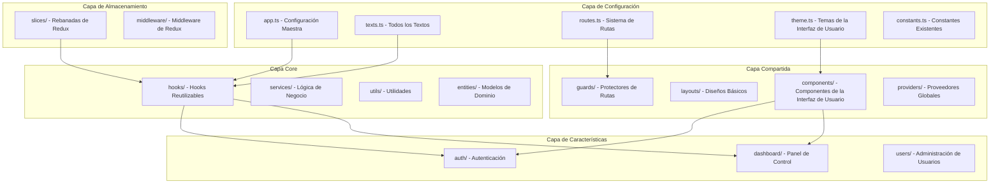

# Documento de Diseño

## Visión General

Este diseño transforma el proyecto LexBot Admin actual en una plantilla base reutilizable mediante la centralización de configuraciones, textos, rutas y la implementación de una arquitectura escalable. El enfoque principal es crear un sistema que permita generar nuevos proyectos rápidamente cambiando solo archivos de configuración, manteniendo toda la funcionalidad y calidad del código existente.

## Arquitectura

### Arquitectura de Alto Nivel



### Diseño de la Estructura de Carpetas

```
src/
├── config/                     # Configuraciones Centralizadas
│   ├── app.ts                 # Configuración Maestra de la Aplicación
│   ├── texts.ts               # Todos los Textos de la Aplicación
│   ├── routes.ts              # Definiciones y Metadatos de Rutas
│   ├── theme.ts               # Configuraciones de Temas
│   └── constants.ts           # Constantes Existentes (mejoradas)
│
├── core/                      # Lógica de Negocio Reutilizable
│   ├── entities/              # Modelos de Dominio y Tipos
│   ├── services/              # Servicios de Negocio (existentes + nuevos)
│   ├── hooks/                 # Hooks Personalizados (existentes + nuevos)
│   └── utils/                 # Funciones de Utilidad (existentes + mejoradas)
│
├── shared/                    # Componentes y Lógica Compartida
│   ├── components/            # Componentes de la Interfaz de Usuario Reutilizables (existentes)
│   │   ├── ui/               # Componentes de la Interfaz de Usuario Básicos
│   │   ├── forms/            # Componentes de Formularios
│   │   └── layout/           # Componentes de Diseño
│   ├── layouts/              # Diseños Básicos
│   ├── guards/               # Protectores de Rutas
│   └── providers/            # Proveedores de Contexto
│
├── features/                  # Código Específico de Características
│   ├── auth/                 # Característica de Autenticación
│   │   ├── components/       # Componentes Específicos de Autenticación
│   │   ├── hooks/           # Hooks Específicos de Autenticación
│   │   ├── pages/           # Páginas de Autenticación
│   │   └── types/           # Tipos de Autenticación
│   ├── dashboard/           # Característica del Panel de Control
│   └── users/               # Característica de Administración de Usuarios (futura)
│
├── store/                    # Administración de Estado Global
│   ├── slices/              # Rebanadas de Redux (existentes)
│   ├── middleware/          # Middleware de Redux (existentes)
│   └── index.ts             # Configuración de la Tienda
│
└── app/                     # Inicialización de la Aplicación
    ├── App.tsx              # Componente Principal de la Aplicación
    ├── main.tsx             # Punto de Entrada
    └── router.tsx           # Configuración de Rutas
```

## Componentes e Interfaces

### 1. Sistema de Configuración

#### Interfaz de Configuración Maestra
```typescript
interface AppConfig {
  info: {
    name: string;
    version: string;
    description: string;
    author: string;
    email: string;
  };
  api: {
    baseUrl: string;
    timeout: number;
    retries: number;
  };
  firebase: FirebaseConfig;
  features: {
    enableAnalytics: boolean;
    enablePWA: boolean;
    enableDarkMode: boolean;
    enableRememberMe: boolean;
    enableEmailVerification: boolean;
    enablePasswordReset: boolean;
    enableRegistration: boolean;
  };
  ui: {
    theme: ThemeConfig;
    animations: AnimationConfig;
    layout: LayoutConfig;
  };
  auth: AuthConfig;
  dev: DevConfig;
}
```

#### Interfaz del Sistema de Textos
```typescript
interface TextConfig {
  app: AppTexts;
  auth: AuthTexts;
  dashboard: DashboardTexts;
  errors: ErrorTexts;
  success: SuccessTexts;
  common: CommonTexts;
}

interface TextInterpolation {
  (key: string, variables?: Record<string, string>): string;
}
```

#### Interfaz del Sistema de Rutas
```typescript
interface RouteConfig {
  public: PublicRoutes;
  private: PrivateRoutes;
  admin: AdminRoutes;
}

interface RouteMeta {
  title: string;
  breadcrumb: string;
  requiresAuth: boolean;
  roles: string[];
  icon?: string;
  description?: string;
}
```

### 2. Diseño del Sistema de Hooks

#### Hook useTexts
```typescript
interface UseTextsReturn {
  t: (key: string, variables?: Record<string, string>) => string;
  auth: AuthTexts;
  dashboard: DashboardTexts;
  app: AppTexts;
  errors: ErrorTexts;
  success: SuccessTexts;
  common: CommonTexts;
  greeting: (name: string) => string;
}
```

#### Hook useConfig
```typescript
interface UseConfigReturn {
  config: AppConfig;
  features: FeatureFlags;
  api: ApiConfig;
  ui: UIConfig;
  isFeatureEnabled: (feature: keyof FeatureFlags) => boolean;
}
```

#### Hook useTheme
```typescript
interface UseThemeReturn {
  theme: ThemeConfig;
  colors: ColorPalette;
  gradients: GradientConfig;
  glass: GlassmorphismConfig;
  currentTheme: string;
  setTheme: (theme: string) => void;
}
```

### 3. Estrategia de Migración de Componentes

#### Antes (Actual)
```typescript
// Textos codificados de manera dura
<h1>¡Bienvenido al Dashboard!</h1>
<p>Hola, {userDisplayName}</p>
<Button>Cerrar Sesión</Button>
```

#### Después (Centralizado)
```typescript
// Usando textos centralizados
const { t, dashboard } = useTexts();

<h1>{dashboard.welcome}</h1>
<p>{t('dashboard.greeting', { name: userDisplayName })}</p>
<Button>{dashboard.logout}</Button>
```

## Modelos de Datos

### Modelos de Configuración

```typescript
// Tipos de configuración principal
export interface ProjectInfo {
  name: string;
  version: string;
  description: string;
  author: string;
  email: string;
}

export interface FeatureFlags {
  enableAnalytics: boolean;
  enablePWA: boolean;
  enableDarkMode: boolean;
  enableRememberMe: boolean;
  enableEmailVerification: boolean;
  enablePasswordReset: boolean;
  enableRegistration: boolean;
}

export interface ThemeConfig {
  name: string;
  colors: ColorPalette;
  gradients: GradientConfig;
  glassmorphism: GlassmorphismConfig;
}

export interface ColorPalette {
  primary: ColorShades;
  secondary: ColorShades;
  accent: ColorShades;
  neutral: ColorShades;
  success: ColorShades;
  warning: ColorShades;
  error: ColorShades;
}
```

### Modelos de Textos

```typescript
// Tipos de configuración de textos
export interface AuthTexts {
  login: LoginTexts;
  register: RegisterTexts;
  forgotPassword: ForgotPasswordTexts;
  resetPassword: ResetPasswordTexts;
}

export interface LoginTexts {
  title: string;
  subtitle: string;
  email: string;
  emailPlaceholder: string;
  password: string;
  passwordPlaceholder: string;
  rememberMe: string;
  forgotPassword: string;
  submitButton: string;
  submittingButton: string;
  registerLink: string;
}

export interface DashboardTexts {
  welcome: string;
  greeting: string; // Plantilla: "Hola, {{name}}"
  sessionStatus: string;
  sessionActive: string;
  logout: string;
  showDemo: string;
  hideDemo: string;
}
```

### Modelos de Rutas

```typescript
// Tipos de configuración de rutas
export interface RouteDefinition {
  path: string;
  component: React.ComponentType;
  meta: RouteMeta;
  children?: RouteDefinition[];
}

export interface RouteMeta {
  title: string;
  breadcrumb: string;
  requiresAuth: boolean;
  roles: string[];
  icon?: string;
  description?: string;
  hideInNavigation?: boolean;
}

export interface RouteParams {
  [key: string]: string | number;
}
```

## Manejo de Errores

### Manejo Centralizado de Errores

```typescript
// Sistema mejorado de manejo de errores
export interface ErrorConfig {
  // Mensajes de error existentes (mantener compatibilidad)
  validation: ValidationErrors;
  auth: AuthErrors;
  api: ApiErrors;
  
  // Nuevas categorías de errores
  config: ConfigErrors;
  routing: RoutingErrors;
  theme: ThemeErrors;
}

export interface ErrorHandler {
  handleValidationError: (error: ValidationError) => string;
  handleAuthError: (error: AuthError) => string;
  handleApiError: (error: ApiError) => string;
  handleConfigError: (error: ConfigError) => string;
  formatError: (error: unknown) => string;
}
```

### Límites de Errores para Características

```typescript
// Límites de errores específicos de características
export interface FeatureErrorBoundary {
  feature: string;
  fallbackComponent: React.ComponentType;
  onError: (error: Error, errorInfo: ErrorInfo) => void;
  resetKeys?: string[];
}
```

## Estrategia de Pruebas

### Enfoque de Pruebas Unitarias

```typescript
// Utilidades de prueba para el nuevo sistema
export interface TestUtils {
  // Configuraciones de prueba
  createMockConfig: (overrides?: Partial<AppConfig>) => AppConfig;
  createMockTexts: (overrides?: Partial<TextConfig>) => TextConfig;
  
  // Ayudantes de prueba
  renderWithConfig: (component: React.ReactElement, config?: AppConfig) => RenderResult;
  renderWithTexts: (component: React.ReactElement, texts?: TextConfig) => RenderResult;
  
  // Pruebas de hooks
  testHook: <T>(hook: () => T, config?: AppConfig) => T;
}
```

### Estrategia de Pruebas de Integración

1. **Carga de Configuraciones**: Probar que todas las configuraciones se carguen correctamente
2. **Interpolación de Textos**: Probar la sustitución de variables en plantillas de texto
3. **Navegación de Rutas**: Probar la generación y navegación de rutas
4. **Aplicación de Temas**: Probar la aplicación de temas
5. **Alternadores de Características**: Probar la activación y desactivación de características

### Pruebas de Migración

1. **Preservación de Funcionalidad**: Asegurarse de que toda la funcionalidad existente funcione
2. **Consistencia Visual**: Asegurarse de que la interfaz de usuario se vea idéntica después de la migración
3. **Rendimiento**: Asegurarse de que no haya degradación del rendimiento
4. **Accesibilidad**: Mantener los estándares de accesibilidad

## Fases de Implementación

### Fase 1: Configuración de la Fundación
1. Crear la nueva estructura de carpetas
2. Implementar el sistema de configuración
3. Crear el sistema de gestión de textos
4. Configurar el sistema de rutas
5. Implementar el sistema de temas

### Fase 2: Migración del Núcleo
1. Migrar los servicios existentes a la capa de núcleo
2. Mejorar los hooks existentes
3. Crear nuevos hooks (useTexts, useConfig, useTheme)
4. Actualizar la estructura de la tienda si es necesario

### Fase 3: Migración de Componentes
1. Migrar el componente del Panel de Control
2. Migrar los componentes de autenticación
3. Migrar los componentes de la interfaz de usuario
4. Actualizar todos los textos codificados de manera dura

### Fase 4: Organización de Características
1. Organizar el código por características
2. Crear componentes específicos de características
3. Implementar protectores de rutas
4. Configurar proveedores

### Fase 5: Finalización del Template
1. Crear el script de inicialización
2. Escribir la documentación completa
3. Crear configuraciones de ejemplo
4. Configurar la suite de pruebas
5. Crear la guía de migración

## Consideraciones de Rendimiento

### Optimización de Paquetes
- Cargar de manera diferida los módulos de características
- Eliminar configuraciones no utilizadas
- Optimizar la carga de textos (considerar dividir por características)
- Minimizar la generación de CSS de temas

### Rendimiento en Tiempo de Ejecución
- Memorizar objetos de configuración
- Memorizar interpolaciones de texto
- Optimizar la re-rendización de hooks
- Utilizar React.memo para componentes estables

### Administración de Memoria
- Evitar fugas de memoria en los observadores de configuración
- Limpiar los oyentes de temas
- Optimizar la estrategia de caché de textos

## Consideraciones de Seguridad

### Seguridad de la Configuración
- Validar todas las entradas de configuración
- Sanitizar interpolaciones de texto
- Manejar de manera segura las variables de entorno
- Prevenir ataques de inyección de configuración

### Seguridad de Rutas
- Implementar protectores de rutas adecuados
- Validar parámetros de ruta
- Proteger el acceso a rutas de administración
- Implementar enrutamiento basado en roles

## Accesibilidad

### Accesibilidad del Sistema de Textos
- Soporte para lectores de pantalla
- Etiquetas ARIA adecuadas desde la configuración de texto
- Formato de idioma específico
- Soporte para temas de alto contraste

### Accesibilidad de Navegación
- Soporte para navegación por teclado
- Manejo de foco en cambios de ruta
- Accesibilidad de migas de pan
- Implementación de enlaces de salto

## Compatibilidad con Navegadores

### Soporte para Navegadores Modernos
- Uso de características ES2020+
- CSS Grid y Flexbox
- APIs de JavaScript modernas
- Mejora progresiva

### Estrategias de Fallback
- Degradación gradual para navegadores más antiguos
- Estrategia de polifill para características faltantes
- Diseños alternativos para un soporte limitado de CSS

Este diseño proporciona una base integral para crear un template altamente reutilizable mientras se mantiene toda la funcionalidad existente y se mejora la arquitectura general de la aplicación.