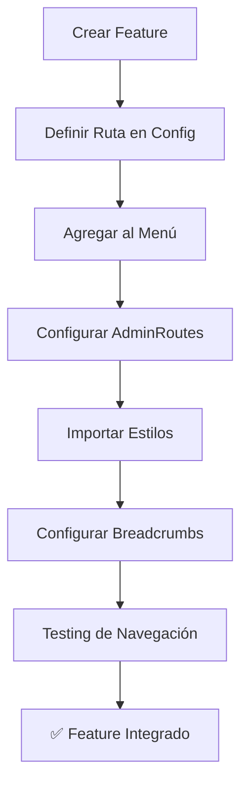

# 🏗️ Features Architecture - Guía Completa para Desarrolladores

_Una documentación tan clara que hasta José Feliciano puede crear features perfectos_ 🎵👨‍🦯

## � Índicet

1. [Arquitectura de Features](#-arquitectura-de-features)
2. [Estructura Estándar](#-estructura-estándar)
3. [Creación de Componentes](#-creación-de-componentes)
4. [Creación de Páginas](#-creación-de-páginas)
5. [Hooks Personalizados](#-hooks-personalizados)
6. [Servicios y APIs](#-servicios-y-apis)
7. [Estilos y Temas](#-estilos-y-temas)
8. [Testing Completo](#-testing-completo)
9. [Integración con el Sistema](#-integración-con-el-sistema)
10. [Mejores Prácticas](#-mejores-prácticas)

---

## 🏗️ Arquitectura de Features

### **Filosofía: "Un Feature, Una Responsabilidad"** 🎯

Cada feature es como un **músico independiente** en una orquesta:

- 🎼 **Autocontenido**: Tiene todo lo que necesita
- 🎵 **Especializado**: Se enfoca en una funcionalidad específica
- 🎶 **Armonioso**: Se integra perfectamente con otros features
- 🎹 **Reutilizable**: Puede tocar en diferentes "conciertos" (proyectos)

### **Mapa de Features Actual**

```
src/features/
├── admin/              🏛️ Layout y navegación (El director de orquesta)
├── dashboard/          📊 Dashboard principal (El solista principal)
├── auth/              🔐 Autenticación (El portero del concierto)
└── [tu-nuevo-feature]/ 🆕 Tu próxima creación
```

---

## 📁 Estructura Estándar

### **Anatomía de un Feature Perfecto** 🧬

```
mi-nuevo-feature/
├── 📄 index.ts                    # 🎯 Exportación principal
├── 📁 components/                 # 🧩 Componentes reutilizables
│   ├── 📄 FeatureCard.tsx        # Componente específico
│   ├── 📄 FeatureList.tsx        # Otro componente
│   ├── 📄 FeatureForm.tsx        # Formularios
│   └── 📄 index.ts               # Exportaciones centralizadas
├── 📁 pages/                     # 📱 Páginas completas
│   ├── 📄 FeaturePage.tsx        # Página principal
│   ├── 📄 FeatureDetailPage.tsx  # Página de detalle
│   └── 📄 index.ts               # Exportaciones
├── 📁 hooks/                     # 🪝 Lógica reutilizable
│   ├── 📄 useFeatureData.ts      # Hook para datos
│   ├── 📄 useFeatureActions.ts   # Hook para acciones
│   └── 📄 index.ts               # Exportaciones
├── 📁 services/                  # 🌐 Comunicación con APIs
│   ├── 📄 featureService.ts      # Servicio principal
│   ├── 📄 featureApi.ts          # Llamadas a API
│   └── 📄 index.ts               # Exportaciones
├── 📁 types/                     # 📝 Definiciones TypeScript
│   ├── 📄 index.ts               # Todos los tipos
│   └── 📄 api.ts                 # Tipos de API (opcional)
├── 📁 styles/                    # 🎨 Estilos específicos
│   ├── 📄 feature.css            # Estilos principales
│   └── 📄 components.css         # Estilos de componentes
├── 📁 __tests__/                 # 🧪 Tests del feature
│   ├── 📄 FeaturePage.test.tsx   # Tests de páginas
│   ├── 📄 components.test.tsx    # Tests de componentes
│   └── 📄 hooks.test.tsx         # Tests de hooks
└── 📁 utils/                     # 🔧 Utilidades específicas
    ├── 📄 featureHelpers.ts      # Funciones auxiliares
    └── 📄 constants.ts           # Constantes del feature
```

---

## 🧩 Creación de Componentes

### **Paso 1: Componente Base** 🎼

```typescript
/**
 * 🎯 FEATURE CARD COMPONENT
 * Componente reutilizable para mostrar información del feature
 */

import React from "react";
import { Button } from "../../../components/ui/Button";
import type { FeatureItem } from "../types";

interface FeatureCardProps {
  item: FeatureItem;
  onEdit?: (id: string) => void;
  onDelete?: (id: string) => void;
  className?: string;
  variant?: "default" | "compact" | "detailed";
}

export const FeatureCard: React.FC<FeatureCardProps> = ({
  item,
  onEdit,
  onDelete,
  className = "",
  variant = "default",
}) => {
  return (
    <div className={`feature-card feature-card--${variant} ${className}`}>
      {/* Header */}
      <div className="feature-card__header">
        <h3 className="feature-card__title">{item.title}</h3>
        {item.status && (
          <span
            className={`feature-card__status feature-card__status--${item.status}`}
          >
            {item.status}
          </span>
        )}
      </div>

      {/* Content */}
      <div className="feature-card__content">
        <p className="feature-card__description">{item.description}</p>

        {variant === "detailed" && item.metadata && (
          <div className="feature-card__metadata">
            <span>Created: {item.metadata.createdAt}</span>
            <span>Updated: {item.metadata.updatedAt}</span>
          </div>
        )}
      </div>

      {/* Actions */}
      {(onEdit || onDelete) && (
        <div className="feature-card__actions">
          {onEdit && (
            <Button
              variant="ghost"
              size="sm"
              onClick={() => onEdit(item.id)}
              icon="✏️"
            >
              Edit
            </Button>
          )}
          {onDelete && (
            <Button
              variant="ghost"
              size="sm"
              onClick={() => onDelete(item.id)}
              icon="🗑️"
              className="feature-card__delete"
            >
              Delete
            </Button>
          )}
        </div>
      )}
    </div>
  );
};

export default FeatureCard;
```

### **Paso 2: Componente de Lista** 📋

```typescript
/**
 * 📋 FEATURE LIST COMPONENT
 * Lista inteligente con filtros, búsqueda y paginación
 */

import React, { useState, useMemo } from "react";
import { FeatureCard } from "./FeatureCard";
import { SearchInput } from "../../../components/ui/SearchInput";
import { FilterDropdown } from "../../../components/ui/FilterDropdown";
import { Pagination } from "../../../components/ui/Pagination";
import type { FeatureItem, FeatureFilter } from "../types";

interface FeatureListProps {
  items: FeatureItem[];
  loading?: boolean;
  onEdit?: (id: string) => void;
  onDelete?: (id: string) => void;
  onAdd?: () => void;
  pageSize?: number;
}

export const FeatureList: React.FC<FeatureListProps> = ({
  items,
  loading = false,
  onEdit,
  onDelete,
  onAdd,
  pageSize = 10,
}) => {
  // Estados locales
  const [searchTerm, setSearchTerm] = useState("");
  const [filter, setFilter] = useState<FeatureFilter>("all");
  const [currentPage, setCurrentPage] = useState(1);

  // Filtrado y búsqueda
  const filteredItems = useMemo(() => {
    return items.filter((item) => {
      // Filtro por búsqueda
      const matchesSearch =
        item.title.toLowerCase().includes(searchTerm.toLowerCase()) ||
        item.description.toLowerCase().includes(searchTerm.toLowerCase());

      // Filtro por estado
      const matchesFilter = filter === "all" || item.status === filter;

      return matchesSearch && matchesFilter;
    });
  }, [items, searchTerm, filter]);

  // Paginación
  const paginatedItems = useMemo(() => {
    const startIndex = (currentPage - 1) * pageSize;
    return filteredItems.slice(startIndex, startIndex + pageSize);
  }, [filteredItems, currentPage, pageSize]);

  const totalPages = Math.ceil(filteredItems.length / pageSize);

  if (loading) {
    return (
      <div className="feature-list feature-list--loading">
        <div className="feature-list__skeleton">
          {Array.from({ length: 3 }).map((_, index) => (
            <div key={index} className="feature-card-skeleton" />
          ))}
        </div>
      </div>
    );
  }

  return (
    <div className="feature-list">
      {/* Header con controles */}
      <div className="feature-list__header">
        <div className="feature-list__controls">
          <SearchInput
            value={searchTerm}
            onChange={setSearchTerm}
            placeholder="Search features..."
            className="feature-list__search"
          />

          <FilterDropdown
            value={filter}
            onChange={setFilter}
            options={[
              { value: "all", label: "All Status" },
              { value: "active", label: "Active" },
              { value: "inactive", label: "Inactive" },
              { value: "pending", label: "Pending" },
            ]}
            className="feature-list__filter"
          />
        </div>

        {onAdd && (
          <Button variant="primary" onClick={onAdd} icon="➕">
            Add Feature
          </Button>
        )}
      </div>

      {/* Lista de items */}
      <div className="feature-list__content">
        {paginatedItems.length > 0 ? (
          <div className="feature-list__grid">
            {paginatedItems.map((item) => (
              <FeatureCard
                key={item.id}
                item={item}
                onEdit={onEdit}
                onDelete={onDelete}
                variant="default"
              />
            ))}
          </div>
        ) : (
          <div className="feature-list__empty">
            <div className="feature-list__empty-icon">📭</div>
            <h3>No features found</h3>
            <p>
              {searchTerm || filter !== "all"
                ? "Try adjusting your search or filters"
                : "Get started by adding your first feature"}
            </p>
            {onAdd && (
              <Button variant="primary" onClick={onAdd}>
                Add First Feature
              </Button>
            )}
          </div>
        )}
      </div>

      {/* Paginación */}
      {totalPages > 1 && (
        <div className="feature-list__footer">
          <Pagination
            currentPage={currentPage}
            totalPages={totalPages}
            onPageChange={setCurrentPage}
            showInfo
            totalItems={filteredItems.length}
          />
        </div>
      )}
    </div>
  );
};

export default FeatureList;
```

---

## 📝 Creación de Formularios

### **Filosofía: Formularios como el Auth** 🎼

Siguiendo el patrón establecido en `src/features/auth`, todos los formularios deben ser:

- 🎯 **Controlados**: Usando React Hook Form
- ✅ **Validados**: Con Zod schemas
- 🎨 **Consistentes**: Mismos componentes UI
- 🔄 **Reactivos**: Estados de loading y error
- 📱 **Responsive**: Funciona en todos los dispositivos

### **Paso 1: Definir el Schema de Validación** 📋

```typescript
// src/features/mi-feature/types/schemas.ts

import { z } from "zod";

/**
 * 📝 FEATURE FORM SCHEMAS
 * Esquemas de validación usando Zod (como en auth)
 */

// Schema para crear item
export const createFeatureItemSchema = z.object({
  title: z
    .string()
    .min(1, "Title is required")
    .min(3, "Title must be at least 3 characters")
    .max(100, "Title must be less than 100 characters"),

  description: z
    .string()
    .min(1, "Description is required")
    .min(10, "Description must be at least 10 characters")
    .max(500, "Description must be less than 500 characters"),

  category: z.string().min(1, "Category is required"),

  priority: z.enum(["low", "medium", "high"], {
    errorMap: () => ({ message: "Priority must be low, medium, or high" }),
  }),

  tags: z.array(z.string()).optional().default([]),

  dueDate: z
    .string()
    .optional()
    .refine((date) => {
      if (!date) return true;
      return new Date(date) > new Date();
    }, "Due date must be in the future"),

  isActive: z.boolean().default(true),
});

// Schema para editar item (todos los campos opcionales excepto ID)
export const updateFeatureItemSchema = createFeatureItemSchema.partial();

// Schema para filtros
export const featureFilterSchema = z.object({
  search: z.string().optional(),
  category: z.string().optional(),
  priority: z.enum(["low", "medium", "high"]).optional(),
  status: z.enum(["active", "inactive", "pending"]).optional(),
  dateFrom: z.string().optional(),
  dateTo: z.string().optional(),
});

// Tipos TypeScript derivados de los schemas
export type CreateFeatureItemData = z.infer<typeof createFeatureItemSchema>;
export type UpdateFeatureItemData = z.infer<typeof updateFeatureItemSchema>;
export type FeatureFilterData = z.infer<typeof featureFilterSchema>;

// Valores por defecto
export const defaultFeatureItemValues: Partial<CreateFeatureItemData> = {
  title: "",
  description: "",
  category: "",
  priority: "medium",
  tags: [],
  isActive: true,
};
```

### **Paso 2: Crear el Componente de Formulario** 📝

```typescript
// src/features/mi-feature/components/FeatureForm.tsx

/**
 * 📝 FEATURE FORM COMPONENT
 * Formulario para crear/editar items del feature
 * Siguiendo el patrón de auth forms
 */

import React, { useEffect } from "react";
import { useForm, Controller } from "react-hook-form";
import { zodResolver } from "@hookform/resolvers/zod";
import { Button } from "../../../components/ui/Button";
import { Input } from "../../../components/ui/Input";
import { Textarea } from "../../../components/ui/Textarea";
import { Select } from "../../../components/ui/Select";
import { Checkbox } from "../../../components/ui/Checkbox";
import { TagInput } from "../../../components/ui/TagInput";
import { DatePicker } from "../../../components/ui/DatePicker";
import { FormField } from "../../../components/ui/FormField";
import {
  createFeatureItemSchema,
  updateFeatureItemSchema,
  defaultFeatureItemValues,
  type CreateFeatureItemData,
  type UpdateFeatureItemData,
} from "../types/schemas";
import type { FeatureItem } from "../types";

interface FeatureFormProps {
  initialData?: FeatureItem | null;
  onSubmit: (
    data: CreateFeatureItemData | UpdateFeatureItemData
  ) => Promise<void>;
  onCancel?: () => void;
  loading?: boolean;
  mode?: "create" | "edit";
}

export const FeatureForm: React.FC<FeatureFormProps> = ({
  initialData,
  onSubmit,
  onCancel,
  loading = false,
  mode = initialData ? "edit" : "create",
}) => {
  // Configurar React Hook Form (como en auth)
  const {
    control,
    handleSubmit,
    formState: { errors, isValid, isDirty },
    reset,
    watch,
  } = useForm<CreateFeatureItemData>({
    resolver: zodResolver(
      mode === "edit" ? updateFeatureItemSchema : createFeatureItemSchema
    ),
    defaultValues: initialData || defaultFeatureItemValues,
    mode: "onChange", // Validación en tiempo real
  });

  // Resetear form cuando cambian los datos iniciales
  useEffect(() => {
    if (initialData) {
      reset(initialData);
    }
  }, [initialData, reset]);

  // Observar cambios para funcionalidades avanzadas
  const watchedPriority = watch("priority");
  const watchedCategory = watch("category");

  /**
   * 🎯 Handle form submission
   */
  const handleFormSubmit = async (data: CreateFeatureItemData) => {
    try {
      await onSubmit(data);
    } catch (error) {
      console.error("Form submission error:", error);
    }
  };

  /**
   * 🎯 Handle form reset
   */
  const handleReset = () => {
    reset(initialData || defaultFeatureItemValues);
  };

  // Opciones para selects
  const categoryOptions = [
    { value: "feature", label: "Feature" },
    { value: "bug", label: "Bug Fix" },
    { value: "improvement", label: "Improvement" },
    { value: "documentation", label: "Documentation" },
  ];

  const priorityOptions = [
    { value: "low", label: "Low Priority" },
    { value: "medium", label: "Medium Priority" },
    { value: "high", label: "High Priority" },
  ];

  return (
    <form onSubmit={handleSubmit(handleFormSubmit)} className="feature-form">
      <div className="feature-form__content">
        {/* Title Field */}
        <FormField label="Title" error={errors.title?.message} required>
          <Controller
            name="title"
            control={control}
            render={({ field }) => (
              <Input
                {...field}
                placeholder="Enter feature title..."
                error={!!errors.title}
                disabled={loading}
              />
            )}
          />
        </FormField>

        {/* Description Field */}
        <FormField
          label="Description"
          error={errors.description?.message}
          required
        >
          <Controller
            name="description"
            control={control}
            render={({ field }) => (
              <Textarea
                {...field}
                placeholder="Describe the feature in detail..."
                rows={4}
                error={!!errors.description}
                disabled={loading}
              />
            )}
          />
        </FormField>

        {/* Category and Priority Row */}
        <div className="feature-form__row">
          <FormField label="Category" error={errors.category?.message} required>
            <Controller
              name="category"
              control={control}
              render={({ field }) => (
                <Select
                  {...field}
                  options={categoryOptions}
                  placeholder="Select category..."
                  error={!!errors.category}
                  disabled={loading}
                />
              )}
            />
          </FormField>

          <FormField label="Priority" error={errors.priority?.message} required>
            <Controller
              name="priority"
              control={control}
              render={({ field }) => (
                <Select
                  {...field}
                  options={priorityOptions}
                  placeholder="Select priority..."
                  error={!!errors.priority}
                  disabled={loading}
                />
              )}
            />
          </FormField>
        </div>

        {/* Tags Field */}
        <FormField
          label="Tags"
          error={errors.tags?.message}
          hint="Add relevant tags to categorize this item"
        >
          <Controller
            name="tags"
            control={control}
            render={({ field }) => (
              <TagInput
                {...field}
                placeholder="Add tags..."
                disabled={loading}
                suggestions={["frontend", "backend", "ui", "api", "database"]}
              />
            )}
          />
        </FormField>

        {/* Due Date Field */}
        <FormField
          label="Due Date"
          error={errors.dueDate?.message}
          hint="Optional deadline for this item"
        >
          <Controller
            name="dueDate"
            control={control}
            render={({ field }) => (
              <DatePicker
                {...field}
                placeholder="Select due date..."
                minDate={new Date()}
                disabled={loading}
              />
            )}
          />
        </FormField>

        {/* Active Status */}
        <FormField label="Status" error={errors.isActive?.message}>
          <Controller
            name="isActive"
            control={control}
            render={({ field: { value, onChange, ...field } }) => (
              <Checkbox
                {...field}
                checked={value}
                onChange={onChange}
                label="Active"
                description="Whether this item is currently active"
                disabled={loading}
              />
            )}
          />
        </FormField>

        {/* Priority Warning */}
        {watchedPriority === "high" && (
          <div className="feature-form__warning">
            <div className="feature-form__warning-icon">⚠️</div>
            <div className="feature-form__warning-content">
              <strong>High Priority Item</strong>
              <p>
                This item will be marked as high priority and may require
                immediate attention.
              </p>
            </div>
          </div>
        )}
      </div>

      {/* Form Actions */}
      <div className="feature-form__actions">
        <div className="feature-form__actions-left">
          {isDirty && (
            <Button
              type="button"
              variant="ghost"
              onClick={handleReset}
              disabled={loading}
            >
              Reset
            </Button>
          )}
        </div>

        <div className="feature-form__actions-right">
          {onCancel && (
            <Button
              type="button"
              variant="ghost"
              onClick={onCancel}
              disabled={loading}
            >
              Cancel
            </Button>
          )}

          <Button
            type="submit"
            variant="primary"
            loading={loading}
            disabled={!isValid || loading}
          >
            {loading
              ? mode === "edit"
                ? "Updating..."
                : "Creating..."
              : mode === "edit"
              ? "Update Item"
              : "Create Item"}
          </Button>
        </div>
      </div>
    </form>
  );
};

export default FeatureForm;
```

### **Paso 3: Formulario de Filtros** 🔍

```typescript
// src/features/mi-feature/components/FeatureFilters.tsx

/**
 * 🔍 FEATURE FILTERS COMPONENT
 * Formulario de filtros para búsqueda avanzada
 */

import React from "react";
import { useForm, Controller } from "react-hook-form";
import { zodResolver } from "@hookform/resolvers/zod";
import { Button } from "../../../components/ui/Button";
import { Input } from "../../../components/ui/Input";
import { Select } from "../../../components/ui/Select";
import { DatePicker } from "../../../components/ui/DatePicker";
import { FormField } from "../../../components/ui/FormField";
import { featureFilterSchema, type FeatureFilterData } from "../types/schemas";

interface FeatureFiltersProps {
  onFilter: (filters: FeatureFilterData) => void;
  onReset: () => void;
  initialFilters?: Partial<FeatureFilterData>;
  loading?: boolean;
}

export const FeatureFilters: React.FC<FeatureFiltersProps> = ({
  onFilter,
  onReset,
  initialFilters = {},
  loading = false,
}) => {
  const {
    control,
    handleSubmit,
    reset,
    watch,
    formState: { isDirty },
  } = useForm<FeatureFilterData>({
    resolver: zodResolver(featureFilterSchema),
    defaultValues: {
      search: "",
      category: "",
      priority: undefined,
      status: undefined,
      dateFrom: "",
      dateTo: "",
      ...initialFilters,
    },
  });

  // Observar cambios para validaciones cruzadas
  const watchedDateFrom = watch("dateFrom");

  /**
   * 🎯 Handle filter submission
   */
  const handleFilterSubmit = (data: FeatureFilterData) => {
    // Limpiar campos vacíos
    const cleanedData = Object.entries(data).reduce((acc, [key, value]) => {
      if (value && value !== "") {
        acc[key as keyof FeatureFilterData] = value;
      }
      return acc;
    }, {} as FeatureFilterData);

    onFilter(cleanedData);
  };

  /**
   * 🎯 Handle reset filters
   */
  const handleReset = () => {
    reset();
    onReset();
  };

  // Opciones para selects
  const categoryOptions = [
    { value: "", label: "All Categories" },
    { value: "feature", label: "Feature" },
    { value: "bug", label: "Bug Fix" },
    { value: "improvement", label: "Improvement" },
    { value: "documentation", label: "Documentation" },
  ];

  const priorityOptions = [
    { value: "", label: "All Priorities" },
    { value: "low", label: "Low Priority" },
    { value: "medium", label: "Medium Priority" },
    { value: "high", label: "High Priority" },
  ];

  const statusOptions = [
    { value: "", label: "All Status" },
    { value: "active", label: "Active" },
    { value: "inactive", label: "Inactive" },
    { value: "pending", label: "Pending" },
  ];

  return (
    <form
      onSubmit={handleSubmit(handleFilterSubmit)}
      className="feature-filters"
    >
      <div className="feature-filters__content">
        {/* Search Field */}
        <FormField label="Search">
          <Controller
            name="search"
            control={control}
            render={({ field }) => (
              <Input
                {...field}
                placeholder="Search by title or description..."
                disabled={loading}
                icon="🔍"
              />
            )}
          />
        </FormField>

        {/* Category and Priority */}
        <div className="feature-filters__row">
          <FormField label="Category">
            <Controller
              name="category"
              control={control}
              render={({ field }) => (
                <Select
                  {...field}
                  options={categoryOptions}
                  disabled={loading}
                />
              )}
            />
          </FormField>

          <FormField label="Priority">
            <Controller
              name="priority"
              control={control}
              render={({ field }) => (
                <Select
                  {...field}
                  options={priorityOptions}
                  disabled={loading}
                />
              )}
            />
          </FormField>

          <FormField label="Status">
            <Controller
              name="status"
              control={control}
              render={({ field }) => (
                <Select {...field} options={statusOptions} disabled={loading} />
              )}
            />
          </FormField>
        </div>

        {/* Date Range */}
        <div className="feature-filters__row">
          <FormField label="Date From">
            <Controller
              name="dateFrom"
              control={control}
              render={({ field }) => (
                <DatePicker
                  {...field}
                  placeholder="Start date..."
                  disabled={loading}
                />
              )}
            />
          </FormField>

          <FormField label="Date To">
            <Controller
              name="dateTo"
              control={control}
              render={({ field }) => (
                <DatePicker
                  {...field}
                  placeholder="End date..."
                  minDate={
                    watchedDateFrom ? new Date(watchedDateFrom) : undefined
                  }
                  disabled={loading}
                />
              )}
            />
          </FormField>
        </div>
      </div>

      {/* Filter Actions */}
      <div className="feature-filters__actions">
        {isDirty && (
          <Button
            type="button"
            variant="ghost"
            onClick={handleReset}
            disabled={loading}
          >
            Clear Filters
          </Button>
        )}

        <Button
          type="submit"
          variant="primary"
          disabled={loading}
          loading={loading}
        >
          Apply Filters
        </Button>
      </div>
    </form>
  );
};

export default FeatureFilters;
```

### **Paso 4: Hook para Formularios** 🪝

```typescript
// src/features/mi-feature/hooks/useFeatureForm.ts

/**
 * 🪝 useFeatureForm Hook
 * Lógica reutilizable para formularios del feature
 */

import { useState, useCallback } from "react";
import { useFeatureActions } from "./useFeatureActions";
import type {
  CreateFeatureItemData,
  UpdateFeatureItemData,
} from "../types/schemas";
import type { FeatureItem } from "../types";

interface UseFeatureFormReturn {
  // Estados
  isSubmitting: boolean;
  submitError: string | null;

  // Acciones
  handleCreate: (data: CreateFeatureItemData) => Promise<FeatureItem>;
  handleUpdate: (
    id: string,
    data: UpdateFeatureItemData
  ) => Promise<FeatureItem>;
  clearError: () => void;

  // Utilidades
  validateForm: (data: any) => boolean;
  getSubmitButtonText: (mode: "create" | "edit", loading: boolean) => string;
}

export const useFeatureForm = (): UseFeatureFormReturn => {
  const { createItem, updateItem } = useFeatureActions();
  const [isSubmitting, setIsSubmitting] = useState(false);
  const [submitError, setSubmitError] = useState<string | null>(null);

  /**
   * 🎯 Handle create item
   */
  const handleCreate = useCallback(
    async (data: CreateFeatureItemData): Promise<FeatureItem> => {
      setIsSubmitting(true);
      setSubmitError(null);

      try {
        const newItem = await createItem(data);
        return newItem;
      } catch (error) {
        const errorMessage =
          error instanceof Error ? error.message : "Failed to create item";
        setSubmitError(errorMessage);
        throw error;
      } finally {
        setIsSubmitting(false);
      }
    },
    [createItem]
  );

  /**
   * 🎯 Handle update item
   */
  const handleUpdate = useCallback(
    async (id: string, data: UpdateFeatureItemData): Promise<FeatureItem> => {
      setIsSubmitting(true);
      setSubmitError(null);

      try {
        const updatedItem = await updateItem(id, data);
        return updatedItem;
      } catch (error) {
        const errorMessage =
          error instanceof Error ? error.message : "Failed to update item";
        setSubmitError(errorMessage);
        throw error;
      } finally {
        setIsSubmitting(false);
      }
    },
    [updateItem]
  );

  /**
   * 🧹 Clear error
   */
  const clearError = useCallback(() => {
    setSubmitError(null);
  }, []);

  /**
   * ✅ Validate form data
   */
  const validateForm = useCallback((data: any): boolean => {
    // Validaciones adicionales que no cubre Zod
    if (data.dueDate && new Date(data.dueDate) <= new Date()) {
      setSubmitError("Due date must be in the future");
      return false;
    }

    if (data.tags && data.tags.length > 10) {
      setSubmitError("Maximum 10 tags allowed");
      return false;
    }

    return true;
  }, []);

  /**
   * 🏷️ Get submit button text
   */
  const getSubmitButtonText = useCallback(
    (mode: "create" | "edit", loading: boolean): string => {
      if (loading) {
        return mode === "edit" ? "Updating..." : "Creating...";
      }
      return mode === "edit" ? "Update Item" : "Create Item";
    },
    []
  );

  return {
    isSubmitting,
    submitError,
    handleCreate,
    handleUpdate,
    clearError,
    validateForm,
    getSubmitButtonText,
  };
};

export default useFeatureForm;
```

### **Paso 5: Estilos para Formularios** 🎨

```css
/* src/features/mi-feature/styles/forms.css */

/**
 * 📝 FEATURE FORMS STYLES
 * Estilos para formularios siguiendo el patrón de auth
 */

/* 📝 FEATURE FORM */
.feature-form {
  display: flex;
  flex-direction: column;
  gap: 1.5rem;
  width: 100%;
  max-width: 600px;
}

.feature-form__content {
  display: flex;
  flex-direction: column;
  gap: 1.5rem;
}

.feature-form__row {
  display: grid;
  grid-template-columns: 1fr 1fr;
  gap: 1rem;
}

.feature-form__warning {
  display: flex;
  gap: 0.75rem;
  padding: 1rem;
  background: var(--admin-warning-bg);
  border: 1px solid var(--admin-warning);
  border-radius: 8px;
  color: var(--admin-warning);
}

.feature-form__warning-icon {
  font-size: 1.25rem;
  flex-shrink: 0;
}

.feature-form__warning-content strong {
  display: block;
  font-weight: 600;
  margin-bottom: 0.25rem;
}

.feature-form__warning-content p {
  font-size: 0.875rem;
  margin: 0;
  opacity: 0.9;
}

.feature-form__actions {
  display: flex;
  justify-content: space-between;
  align-items: center;
  gap: 1rem;
  padding-top: 1rem;
  border-top: 1px solid var(--admin-border-color);
}

.feature-form__actions-left,
.feature-form__actions-right {
  display: flex;
  gap: 0.75rem;
  align-items: center;
}

/* 🔍 FEATURE FILTERS */
.feature-filters {
  display: flex;
  flex-direction: column;
  gap: 1.5rem;
  padding: 1.5rem;
  background: var(--admin-glass-bg);
  border: 1px solid var(--admin-glass-border);
  border-radius: 12px;
  box-shadow: var(--admin-glass-shadow);
}

.feature-filters__content {
  display: flex;
  flex-direction: column;
  gap: 1rem;
}

.feature-filters__row {
  display: grid;
  grid-template-columns: repeat(auto-fit, minmax(200px, 1fr));
  gap: 1rem;
}

.feature-filters__actions {
  display: flex;
  justify-content: flex-end;
  gap: 0.75rem;
  padding-top: 1rem;
  border-top: 1px solid var(--admin-border-color);
}

/* 📱 RESPONSIVE */
@media (max-width: 768px) {
  .feature-form__row {
    grid-template-columns: 1fr;
  }

  .feature-form__actions {
    flex-direction: column;
    align-items: stretch;
  }

  .feature-form__actions-left,
  .feature-form__actions-right {
    justify-content: center;
  }

  .feature-filters__row {
    grid-template-columns: 1fr;
  }

  .feature-filters__actions {
    flex-direction: column;
  }
}

/* 🎭 FORM STATES */
.feature-form--loading {
  opacity: 0.7;
  pointer-events: none;
}

.feature-form--error {
  border-color: var(--admin-error);
}

.feature-form--success {
  border-color: var(--admin-success);
}
```

### **Paso 6: Uso en la Página** 📱

```typescript
// En tu FeaturePage.tsx

import { FeatureForm } from "../components/FeatureForm";
import { useFeatureForm } from "../hooks/useFeatureForm";

export const FeaturePage: React.FC = () => {
  const { handleCreate, handleUpdate, isSubmitting, submitError } =
    useFeatureForm();

  const handleFormSubmit = async (data: CreateFeatureItemData) => {
    try {
      if (editingItem) {
        await handleUpdate(editingItem.id, data);
      } else {
        await handleCreate(data);
      }

      // Cerrar modal, refrescar datos, etc.
      setShowModal(false);
      refreshData();
    } catch (error) {
      // Error ya manejado en el hook
    }
  };

  return (
    <div className="feature-page">
      {/* Modal con formulario */}
      {showModal && (
        <Modal>
          <FeatureForm
            initialData={editingItem}
            onSubmit={handleFormSubmit}
            onCancel={() => setShowModal(false)}
            loading={isSubmitting}
          />

          {submitError && <div className="form-error">{submitError}</div>}
        </Modal>
      )}
    </div>
  );
};
```

---

### **✅ Hacer - La Sinfonía Perfecta** 🎼

#### **🏗️ Arquitectura**

- **Un feature, una responsabilidad**: Como un músico especializado
- **Exportaciones centralizadas**: Todo organizado en `index.ts`
- **Estructura consistente**: Mismo patrón en todos los features
- **Separación clara**: Componentes, páginas, hooks, servicios separados

#### **🧩 Componentes**

- **Componentes pequeños y enfocados**: Fáciles de testear y mantener
- **Props bien tipadas**: TypeScript para prevenir errores
- **Estados locales mínimos**: Solo lo necesario en cada componente
- **Reutilización inteligente**: Componentes que sirven para múltiples casos

### **❌ No Hacer - Evitar la Cacofonía** 🚫

#### **🏗️ Arquitectura**

- **Mezclar responsabilidades**: Un feature haciendo trabajo de otro
- **Dependencias circulares**: Feature A depende de B que depende de A
- **Rutas hardcodeadas**: Usar strings en lugar de constantes
- **Lógica en componentes**: Business logic debe estar en hooks/servicios

---

## 🚀 Checklist de Creación

### **📋 Antes de Empezar** ✅

- [ ] **🎯 Definir propósito**: ¿Qué problema resuelve este feature?
- [ ] **📐 Diseñar estructura**: ¿Qué componentes y páginas necesito?
- [ ] **🔗 Planear integración**: ¿Cómo se conecta con el sistema existente?
- [ ] **📊 Definir datos**: ¿Qué tipos y APIs necesito?

### **🏗️ Durante el Desarrollo** ✅

- [ ] **📁 Crear estructura**: Carpetas y archivos base
- [ ] **📝 Definir tipos**: TypeScript interfaces y types
- [ ] **🧩 Crear componentes**: Empezar por los más simples
- [ ] **📱 Implementar páginas**: Usar componentes creados
- [ ] **🪝 Desarrollar hooks**: Lógica de datos y acciones
- [ ] **🌐 Crear servicios**: Comunicación con APIs
- [ ] **🎨 Aplicar estilos**: Responsive y consistente
- [ ] **🧪 Escribir tests**: Cobertura completa

### **🔗 Integración Final** ✅

- [ ] **🧭 Agregar al menú**: Configurar navegación
- [ ] **🛣️ Configurar rutas**: AdminRoutes y paths
- [ ] **🎨 Importar estilos**: CSS en index principal
- [ ] **📚 Actualizar docs**: README y comentarios
- [ ] **🧪 Tests E2E**: Flujo completo de usuario
- [ ] **🔍 Code review**: Revisión por pares
- [ ] **🚀 Deploy**: A staging primero

---

## 🎵 Conclusión

_"Crear un feature es como componer una canción: cada nota debe estar en su lugar, cada instrumento debe sonar en armonía, y el resultado debe emocionar al oyente"_ 🎼

Con esta guía, José Feliciano puede crear features tan perfectos que hasta él mismo los puede "ver" funcionando. Cada feature será:

- 🎯 **Enfocado**: Una responsabilidad clara
- 🏗️ **Bien estructurado**: Organización consistente
- 🧩 **Modular**: Componentes reutilizables
- 🪝 **Inteligente**: Hooks bien diseñados
- 🎨 **Hermoso**: UI/UX pulida
- 🧪 **Confiable**: Tests completos
- 📚 **Documentado**: Fácil de entender

¡Ahora a crear features que hagan que hasta los desarrolladores más experimentados aplaudan de pie! 👏🎵

---

## 🧭 Integración Completa con la Navegación

### **🎯 Flujo Completo de Integración**



### **Paso 1: Configurar Rutas Centralizadas** ⚙️

```typescript
// src/config/routes.ts

export const PATHS = {
  private: {
    // ... rutas existentes
    dashboard: "/admin/dashboard",
    recipients: "/admin/recipients",

    // 🆕 Tu nuevo feature
    miFeature: "/admin/mi-feature",
    miFeatureDetail: "/admin/mi-feature/:id",
    miFeatureCreate: "/admin/mi-feature/create",
    miFeatureEdit: "/admin/mi-feature/:id/edit",
  },
} as const;

// 🎯 Helper para generar rutas dinámicas
export const generatePath = {
  miFeatureDetail: (id: string) => `/admin/mi-feature/${id}`,
  miFeatureEdit: (id: string) => `/admin/mi-feature/${id}/edit`,
} as const;
```

### **Paso 2: Agregar al Menú de Navegación** 🧭

```typescript
// src/features/admin/config/menuConfig.ts

import { PATHS } from "../../../config/routes";
import type { MenuItem } from "../types";

export const defaultMenuItems: MenuItem[] = [
  // Dashboard (existente)
  {
    id: "dashboard",
    label: "Dashboard",
    icon: "dashboard",
    route: PATHS.private.dashboard,
  },

  // 🆕 Tu nuevo feature
  {
    id: "mi-feature",
    label: "Mi Feature",
    icon: "🎯", // Puedes usar emojis o nombres de iconos
    route: PATHS.private.miFeature,
    badge: "New", // Opcional: badge para destacar
    permissions: ["feature.read"], // Opcional: permisos requeridos
  },

  // Feature con sub-menús (ejemplo avanzado)
  {
    id: "mi-feature-advanced",
    label: "Feature Avanzado",
    icon: "⚡",
    route: PATHS.private.miFeature,
    children: [
      {
        id: "mi-feature-list",
        label: "Ver Lista",
        icon: "📋",
        route: PATHS.private.miFeature,
      },
      {
        id: "mi-feature-create",
        label: "Crear Nuevo",
        icon: "➕",
        route: PATHS.private.miFeatureCreate,
      },
    ],
  },
];
```

### **Paso 3: Configurar Rutas en AdminRoutes** 🛣️

```typescript
// src/routes/AdminRoutes.tsx

import React from "react";
import { Routes, Route, Navigate } from "react-router-dom";
import { AdminLayout } from "../features/admin/components/layout/AdminLayout";
import { ProtectedRoute } from "./ProtectedRoute";

// 🆕 Importar páginas de tu feature
import {
  FeaturePage,
  FeatureDetailPage,
  FeatureCreatePage,
  FeatureEditPage,
} from "../features/mi-feature/pages";

export const AdminRoutes: React.FC = () => {
  return (
    <ProtectedRoute>
      <AdminLayout>
        <Routes>
          {/* Dashboard */}
          <Route path="dashboard" element={<DashboardPage />} />

          {/* 🆕 Rutas de tu feature */}
          <Route path="mi-feature">
            {/* Ruta principal - lista */}
            <Route index element={<FeaturePage />} />

            {/* Crear nuevo */}
            <Route path="create" element={<FeatureCreatePage />} />

            {/* Ver detalle */}
            <Route path=":id" element={<FeatureDetailPage />} />

            {/* Editar */}
            <Route path=":id/edit" element={<FeatureEditPage />} />
          </Route>

          {/* Redirects */}
          <Route path="" element={<Navigate to="dashboard" replace />} />
          <Route path="*" element={<Navigate to="dashboard" replace />} />
        </Routes>
      </AdminLayout>
    </ProtectedRoute>
  );
};
```

### **Paso 4: Configurar Breadcrumbs en tu Feature** 🍞

```typescript
// src/features/mi-feature/pages/FeaturePage.tsx

import React, { useEffect } from "react";
import { useParams } from "react-router-dom";
import { useAdminLayoutManager } from "../../admin/hooks/useAdminLayoutManager";
import type { Breadcrumb } from "../../admin/types";

export const FeaturePage: React.FC = () => {
  const { actions } = useAdminLayoutManager();
  const { id } = useParams();

  /**
   * 🍞 Configurar breadcrumbs dinámicos
   */
  useEffect(() => {
    const breadcrumbs: Breadcrumb[] = [
      {
        label: "Dashboard",
        route: "/admin/dashboard",
        isActive: false,
      },
      {
        label: "Mi Feature",
        route: "/admin/mi-feature",
        isActive: !id, // Activo solo si no hay ID (lista principal)
      },
    ];

    // Si estamos viendo un detalle, agregar breadcrumb específico
    if (id) {
      breadcrumbs.push({
        label: `Item ${id}`,
        route: `/admin/mi-feature/${id}`,
        isActive: true,
      });
    }

    actions.setBreadcrumbs(breadcrumbs);
    actions.setActiveRoute(window.location.pathname);
  }, [actions, id]);

  // ... resto del componente
};
```

### **Paso 5: Navegación Programática en Componentes** 🎯

```typescript
// src/features/mi-feature/components/FeatureCard.tsx

import React from "react";
import { useAdminLayoutManager } from "../../admin/hooks/useAdminLayoutManager";
import { generatePath, PATHS } from "../../../config/routes";
import { Button } from "../../../components/ui/Button";

export const FeatureCard: React.FC<FeatureCardProps> = ({ item }) => {
  const { actions } = useAdminLayoutManager();

  /**
   * 🎯 Navegación a detalle
   */
  const handleViewDetail = () => {
    const detailPath = generatePath.miFeatureDetail(item.id);
    actions.navigateTo(detailPath);
  };

  /**
   * 🎯 Navegación a edición
   */
  const handleEdit = () => {
    const editPath = generatePath.miFeatureEdit(item.id);
    actions.navigateTo(editPath);
  };

  return (
    <div className="feature-card">
      {/* ... contenido de la card */}

      <div className="feature-card__actions">
        <Button onClick={handleViewDetail} variant="ghost">
          Ver Detalle
        </Button>
        <Button onClick={handleEdit} variant="primary">
          Editar
        </Button>
      </div>
    </div>
  );
};
```

### **Paso 6: Importar Estilos del Feature** 🎨

```css
/* src/styles/admin/index.css */

/* 🎯 CORE ADMIN STYLES */
@import "./variables.css";
@import "./layout.css";
@import "./header.css";
@import "./navigation.css";
@import "./main.css";
@import "./responsive.css";
@import "./transitions.css";

/* 🎨 FEATURE SPECIFIC STYLES */
@import "../features/dashboard/styles/dashboard.css";
@import "../features/mi-feature/styles/feature.css"; /* 🆕 Tu feature */
```

### **🎯 Checklist de Integración de Navegación** ✅

#### **📋 Configuración Base**

- [ ] **Definir rutas** en `src/config/routes.ts`
- [ ] **Agregar al menú** en `menuConfig.ts`
- [ ] **Configurar AdminRoutes** con todas las rutas del feature
- [ ] **Importar estilos** en `src/styles/admin/index.css`

#### **🧭 Navegación Funcional**

- [ ] **Breadcrumbs dinámicos** en cada página
- [ ] **Navegación programática** en componentes
- [ ] **Active route** se actualiza correctamente
- [ ] **Menú highlighting** funciona

#### **🛡️ Seguridad y Permisos**

- [ ] **Permisos configurados** (si aplica)
- [ ] **Rutas protegidas** correctamente
- [ ] **Verificación de acceso** en componentes

#### **🧪 Testing**

- [ ] **Tests de navegación** funcionando
- [ ] **Breadcrumbs testing** implementado
- [ ] **Routing integration** testeado

### **🚨 Problemas Comunes y Soluciones**

#### **❌ Problema: Menú no se actualiza**

```typescript
// ✅ Solución: Verificar que el ID del menú coincida con la ruta
{
  id: 'mi-feature', // Debe coincidir con el path
  route: '/admin/mi-feature', // Ruta exacta
}
```

#### **❌ Problema: Breadcrumbs no aparecen**

```typescript
// ✅ Solución: Configurar breadcrumbs en useEffect
useEffect(() => {
  actions.setBreadcrumbs([...]);
  actions.setActiveRoute(location.pathname);
}, [actions, location.pathname]);
```

#### **❌ Problema: Navegación no funciona en mobile**

```typescript
// ✅ Solución: Usar smartNavigateTo que cierra el sidebar móvil
const { actions } = useAdminLayoutManager();
actions.navigateTo("/ruta"); // Ya maneja mobile automáticamente
```

### **🎵 Navegación Perfecta Lograda**

¡Con estos pasos, José Feliciano puede navegar por tu feature como si fuera su propia casa! 🏠🎵
