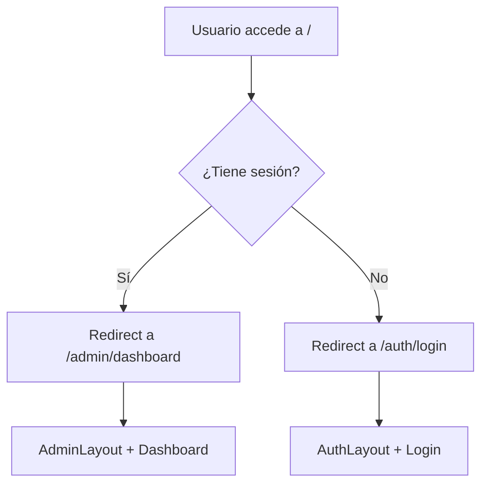
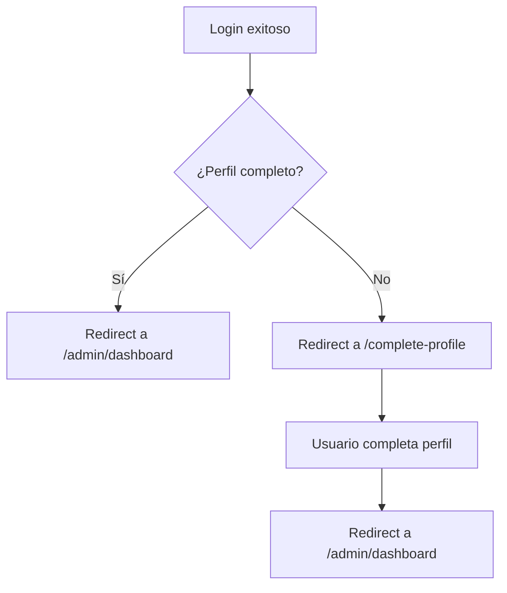
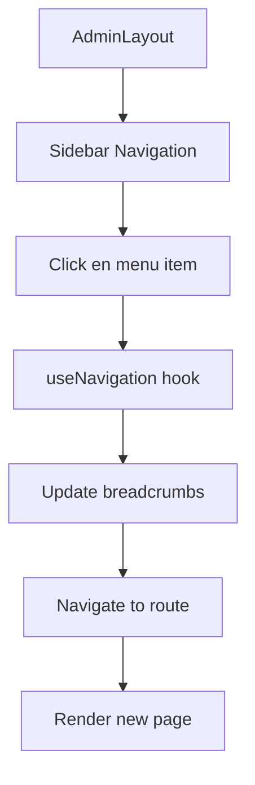
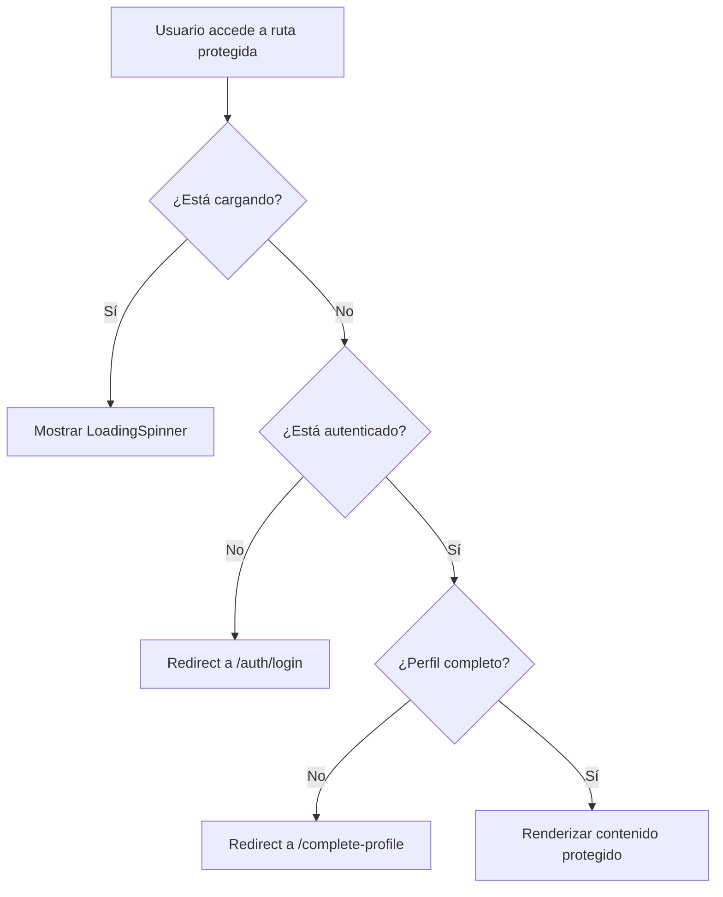

# 🧭 Sistema de Navegación - Guía Completa

*Una documentación tan clara que hasta José Feliciano la puede seguir sin problemas* 🎵

## 📋 Índice
1. [Arquitectura General](#-arquitectura-general)
2. [Flujo de Navegación](#-flujo-de-navegación)
3. [Componentes de Routing](#-componentes-de-routing)
4. [Protección de Rutas](#-protección-de-rutas)
5. [Estados de Autenticación](#-estados-de-autenticación)
6. [Transiciones y UX](#-transiciones-y-ux)
7. [Configuración de Rutas](#-configuración-de-rutas)
8. [Debugging y Troubleshooting](#-debugging-y-troubleshooting)

---

## 🏗️ Arquitectura General

### Estructura de Archivos
```
src/routes/
├── AppRoutes.tsx          # 🎯 Router principal - Punto de entrada
├── AdminRoutes.tsx        # 🏛️ Rutas del área administrativa
├── AuthRoutes.tsx         # 🔐 Rutas de autenticación
├── ProtectedRoute.tsx     # 🛡️ Componente de protección
└── README.md             # 📚 Esta documentación
```

### Jerarquía de Routing
```
AppRoutes (Raíz)
├── / (Redirect inteligente)
├── /auth/* → AuthRoutes
│   ├── /auth/login
│   ├── /auth/register
│   ├── /auth/forgot-password
│   └── /auth/reset-password
├── /admin/* → AdminRoutes (Protegido)
│   ├── /admin/dashboard
│   ├── /admin/recipients
│   └── /admin/settings
└── /complete-profile (Protegido)
```

---

## 🌊 Flujo de Navegación

### 1. **Entrada a la Aplicación**


### 2. **Proceso de Autenticación**


### 3. **Navegación en Admin**


---

## 🧩 Componentes de Routing

### **AppRoutes.tsx** - El Director de Orquesta 🎼

```typescript
// Responsabilidades:
// 1. Configurar el router principal
// 2. Manejar redirects inteligentes
// 3. Aplicar transiciones entre páginas
// 4. Distribuir rutas a sub-routers

export const AppRoutes: React.FC = () => {
  // 🎭 Manejo de transiciones suaves
  const [transitionStage, setTransitionStage] = useState<'fadeIn' | 'fadeOut'>('fadeIn');
  
  // 🧭 Detección de cambios de ruta
  useEffect(() => {
    if (location.pathname !== displayLocation.pathname) {
      setTransitionStage('fadeOut'); // Fade out actual
      // Después de 100ms, cambia a la nueva ruta y fade in
    }
  }, [location.pathname]);
}
```

**Características Especiales:**
- ✨ **Transiciones suaves**: Fade in/out entre páginas
- 🎯 **Redirect inteligente**: Detecta autenticación automáticamente
- 🔄 **Compatibilidad**: Maneja rutas legacy y nuevas

### **AdminRoutes.tsx** - El Área VIP 🏛️

```typescript
// Responsabilidades:
// 1. Envolver todo en AdminLayout
// 2. Proteger todas las rutas
// 3. Configurar rutas anidadas
// 4. Manejar redirects internos

export const AdminRoutes: React.FC = () => {
  return (
    <ProtectedRoute>           {/* 🛡️ Protección */}
      <AdminLayout>            {/* 🏛️ Layout */}
        <Routes>               {/* 🧭 Rutas anidadas */}
          <Route path="dashboard" element={<DashboardPage />} />
          <Route path="recipients" element={<RecipientsPage />} />
          {/* Redirects automáticos */}
          <Route path="" element={<Navigate to="dashboard" replace />} />
          <Route path="*" element={<Navigate to="dashboard" replace />} />
        </Routes>
      </AdminLayout>
    </ProtectedRoute>
  );
};
```

**Características Especiales:**
- 🛡️ **Protección total**: Todas las rutas requieren autenticación
- 🏛️ **Layout consistente**: AdminLayout en todas las páginas
- 🔄 **Redirects inteligentes**: Rutas inválidas van al dashboard
- 📱 **Responsive**: Layout se adapta automáticamente

### **AuthRoutes.tsx** - La Puerta de Entrada 🚪

```typescript
// Responsabilidades:
// 1. Rutas públicas de autenticación
// 2. Redirect si ya está autenticado
// 3. Manejo de estados de carga
// 4. Formularios de auth

export const AuthRoutes: React.FC = () => {
  return (
    <Routes>
      <Route path="login" element={<LoginPage />} />
      <Route path="register" element={<RegisterPage />} />
      <Route path="forgot-password" element={<ForgotPasswordPage />} />
      <Route path="reset-password" element={<ResetPasswordPage />} />
      {/* Redirect por defecto */}
      <Route path="*" element={<Navigate to="login" replace />} />
    </Routes>
  );
};
```

**Características Especiales:**
- 🔓 **Acceso público**: No requiere autenticación
- 🔄 **Auto-redirect**: Si ya está logueado, va al admin
- 📱 **Mobile-first**: Optimizado para dispositivos móviles
- 🎨 **Branded**: Usa el tema de la marca

### **ProtectedRoute.tsx** - El Guardián 🛡️

```typescript
// Responsabilidades:
// 1. Verificar autenticación
// 2. Verificar perfil completo
// 3. Redirects automáticos
// 4. Loading states

export const ProtectedRoute: React.FC<ProtectedRouteProps> = ({ children }) => {
  const { isAuthenticated, userProfile, loading } = useAuth();
  
  // 🔄 Mientras carga, muestra spinner
  if (loading) return <LoadingSpinner />;
  
  // 🚫 No autenticado → Login
  if (!isAuthenticated) return <Navigate to="/auth/login" replace />;
  
  // ⚠️ Perfil incompleto → Complete Profile
  if (userProfile && !userProfile.isComplete) {
    return <Navigate to="/complete-profile" replace />;
  }
  
  // ✅ Todo OK → Renderizar contenido
  return <>{children}</>;
};
```

**Estados que maneja:**
- 🔄 **Loading**: Verificando autenticación
- 🚫 **No autenticado**: Redirect a login
- ⚠️ **Perfil incompleto**: Redirect a completar perfil
- ✅ **Autorizado**: Renderiza el contenido

---

## 🔐 Protección de Rutas

### Niveles de Protección

#### **Nivel 1: Rutas Públicas** 🌍
```typescript
// Accesibles sin autenticación
/auth/login
/auth/register
/auth/forgot-password
/auth/reset-password
```

#### **Nivel 2: Rutas Semi-Protegidas** ⚠️
```typescript
// Requieren autenticación pero perfil puede estar incompleto
/complete-profile
```

#### **Nivel 3: Rutas Completamente Protegidas** 🔒
```typescript
// Requieren autenticación Y perfil completo
/admin/*
```

### Flujo de Verificación



---

## 🎭 Estados de Autenticación

### **Estado: Loading** 🔄
```typescript
// Cuando se está verificando la sesión
if (loading) {
  return (
    <div className="auth-loading">
      <Spinner />
      <p>Verificando sesión...</p>
    </div>
  );
}
```

### **Estado: No Autenticado** 🚫
```typescript
// Usuario no tiene sesión válida
if (!isAuthenticated) {
  return <Navigate to="/auth/login" replace />;
}
```

### **Estado: Perfil Incompleto** ⚠️
```typescript
// Usuario autenticado pero perfil incompleto
if (userProfile && !userProfile.isComplete) {
  return <Navigate to="/complete-profile" replace />;
}
```

### **Estado: Completamente Autorizado** ✅
```typescript
// Usuario puede acceder a todo el admin
return <>{children}</>;
```

---

## 🎨 Transiciones y UX

### **Transiciones entre Páginas**

```typescript
// En AppRoutes.tsx
const [transitionStage, setTransitionStage] = useState<'fadeIn' | 'fadeOut'>('fadeIn');

// CSS para las transiciones
.transition-opacity {
  transition: opacity 200ms ease-in-out;
}

.opacity-0 { opacity: 0; }
.opacity-100 { opacity: 1; }
```

**Beneficios:**
- ✨ **Suavidad visual**: No hay saltos bruscos
- 🎯 **Feedback inmediato**: Usuario sabe que algo está pasando
- 📱 **Mobile-friendly**: Transiciones optimizadas para touch

### **Loading States**

```typescript
// Diferentes tipos de loading
<LoadingSpinner />              // Verificando auth
<PageSkeleton />               // Cargando página
<ComponentPlaceholder />       // Cargando componente
```

---

## ⚙️ Configuración de Rutas

### **Archivo de Configuración: `src/config/routes.ts`**

```typescript
export const PATHS = {
  public: {
    login: '/auth/login',
    register: '/auth/register',
    forgotPassword: '/auth/forgot-password',
    resetPassword: '/auth/reset-password',
  },
  private: {
    dashboard: '/admin/dashboard',
    recipients: '/admin/recipients',
    settings: '/admin/settings',
    completeProfile: '/complete-profile',
  },
} as const;
```

**Ventajas:**
- 🎯 **Centralizado**: Todas las rutas en un lugar
- 🔧 **Fácil mantenimiento**: Cambiar una ruta actualiza todo
- 🛡️ **Type-safe**: TypeScript previene errores
- 📚 **Documentado**: Fácil de entender

### **Configuración del Menú: `src/features/admin/config/menuConfig.ts`**

```typescript
export const defaultMenuItems: MenuItem[] = [
  {
    id: 'dashboard',
    label: 'Dashboard',
    icon: 'dashboard',
    route: '/admin/dashboard',        // 🎯 Conecta con PATHS
  },
  {
    id: 'recipients',
    label: 'Gestionar Destinatarios',
    icon: 'users',
    route: '/admin/recipients',       // 🎯 Conecta con PATHS
  },
];
```

---

## 🐛 Debugging y Troubleshooting

### **Problemas Comunes y Soluciones**

#### **1. "Redirect Loop" - Bucle Infinito** 🔄
```typescript
// ❌ Problema: Redirect infinito
if (!isAuthenticated) {
  return <Navigate to="/auth/login" replace />;
}
if (location.pathname === '/auth/login' && isAuthenticated) {
  return <Navigate to="/admin/dashboard" replace />;
}

// ✅ Solución: Usar el componente AuthRedirect
const AuthRedirect = () => {
  const isAuthenticated = sessionService.hasSession();
  return (
    <Navigate 
      to={isAuthenticated ? '/admin/dashboard' : '/auth/login'} 
      replace 
    />
  );
};
```

#### **2. "Route Not Found" - Ruta No Encontrada** 🚫
```typescript
// ✅ Siempre incluir catch-all routes
<Route path="*" element={<Navigate to="dashboard" replace />} />
```

#### **3. "Protected Route Not Working" - Protección No Funciona** 🛡️
```typescript
// ✅ Verificar orden de verificaciones
// 1. Loading primero
// 2. Autenticación segundo  
// 3. Perfil completo tercero
// 4. Renderizar último
```

### **Herramientas de Debug**

#### **React Router DevTools**
```typescript
// En desarrollo, agregar logging
useEffect(() => {
  console.log('🧭 Route changed:', location.pathname);
  console.log('🔐 Auth state:', { isAuthenticated, userProfile });
}, [location.pathname, isAuthenticated, userProfile]);
```

#### **Redux DevTools**
```typescript
// Monitorear estado de navegación
const navigation = useSelector((state: RootState) => state.admin.navigation);
console.log('📊 Navigation state:', navigation);
```

### **Checklist de Debugging** ✅

Cuando algo no funciona, verificar en orden:

1. **🔍 URL correcta**: ¿La URL es la esperada?
2. **🔐 Estado de auth**: ¿El usuario está autenticado?
3. **👤 Perfil completo**: ¿El perfil está completo?
4. **🧭 Configuración de rutas**: ¿La ruta está definida?
5. **🛡️ ProtectedRoute**: ¿Está envolviendo correctamente?
6. **📱 Responsive**: ¿Funciona en mobile?
7. **🎭 Transiciones**: ¿Las transiciones son suaves?

---

## 🎯 Mejores Prácticas

### **✅ Hacer**
- Usar `replace` en redirects automáticos
- Manejar todos los estados de loading
- Incluir catch-all routes (`*`)
- Usar rutas relativas en componentes anidados
- Centralizar configuración de rutas
- Testear en diferentes dispositivos

### **❌ No Hacer**
- Crear bucles de redirect
- Olvidar manejar estados de loading
- Usar rutas hardcodeadas en componentes
- Ignorar casos edge (rutas inválidas)
- Mezclar lógica de auth con routing
- Olvidar la experiencia mobile

---

## 🚀 Extensibilidad

### **Agregar Nueva Ruta Protegida**

1. **Definir en configuración**:
```typescript
// src/config/routes.ts
export const PATHS = {
  private: {
    // ... existentes
    newFeature: '/admin/new-feature',
  },
};
```

2. **Agregar al menú**:
```typescript
// src/features/admin/config/menuConfig.ts
{
  id: 'new-feature',
  label: 'Nueva Funcionalidad',
  icon: 'star',
  route: PATHS.private.newFeature,
}
```

3. **Configurar ruta**:
```typescript
// src/routes/AdminRoutes.tsx
<Route path="new-feature" element={<NewFeaturePage />} />
```

### **Agregar Nueva Ruta Pública**

1. **Definir en configuración**:
```typescript
// src/config/routes.ts
export const PATHS = {
  public: {
    // ... existentes
    help: '/help',
  },
};
```

2. **Agregar a AppRoutes**:
```typescript
// src/routes/AppRoutes.tsx
<Route path="/help" element={<HelpPage />} />
```

---

## 🎵 Conclusión

*"En el mundo de la navegación, como en la música, cada nota debe estar en su lugar correcto para crear una sinfonía perfecta"* 🎼

Este sistema de navegación está diseñado para ser:
- 🎯 **Intuitivo**: Fácil de entender y usar
- 🛡️ **Seguro**: Protección robusta en múltiples niveles
- 🚀 **Escalable**: Fácil agregar nuevas rutas y features
- 📱 **Responsive**: Funciona perfecto en todos los dispositivos
- 🎨 **Elegante**: Transiciones suaves y UX pulida

¡Ahora José Feliciano puede navegar por nuestra app con los ojos cerrados! 👨‍🦯🎵